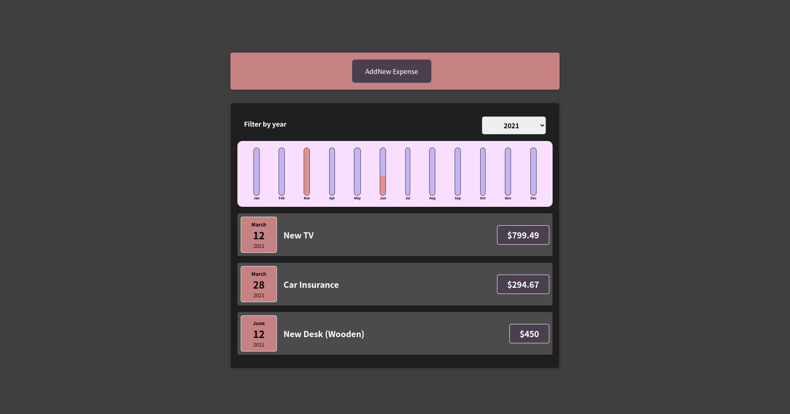

# Expense Tracker
ReactJS | Vanilla CSS | ES6

## Description
This is a project I completed through the Udemy React Course.  It is a ReactJS project that is fully functional, other than the hard-coded expense data found in an array.  You may still add data, however it will not be saved to a database.  This project utilizes the 2-way binding method, and passes props both ways.  The file tree is packed with smaller components for ease of navigation in the code editor.  Although I perfer to use TailwindCSS as my styling framework, theis course module expected that I use Vanilla CSS.  Each component has it's own CSS file with conventional naming for an easy to follow experience.  This is the first of a few projects required for completion of this course.

<a href='https://udemy-react-project.vercel.app/' target='_blank' rel='noreferrer'>Visit the live project</a>

## Installation
Clone this repository into a local file 
In your computer's teminal, cd into the file with the newly cloned repository 
Run `npm install` 
Run `npm start` 
Your browser will automatically open the App.

## Contact Information
[wlowrimore@gmail.com](mailto:wlowrimore@gmmail.com) 
[https://www.williamlowrimore.com](https://www.williamlowrimore.com)